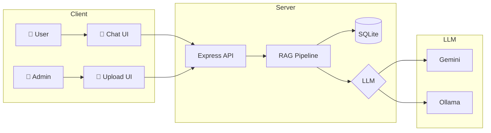

<div align="center">

# 🤖 Thai RAG Chatbot

### ระบบ Chatbot อัจฉริยะที่ตอบคำถามจากเอกสาร พร้อมรองรับภาษาไทย

[](https://nodejs.org/)
[](https://expressjs.com/)
[](https://sqlite.org/)
[](https://ai.google.dev/)
[](https://ollama.ai/)

[Features](#-features) •
[Installation](#-installation) •
[Usage](#-usage) •
[Configuration](#%EF%B8%8F-configuration) •
[API](#-api-endpoints)

</div>

---

## ✨ Features

<table>
<tr>
<td>

### 🔍 Smart RAG Pipeline
- Semantic search ด้วย Vector embeddings
- Keyword fallback เมื่อ API ไม่พร้อม
- Top-K retrieval พร้อม relevance scoring

</td>
<td>

### 🇹🇭 Thai Optimized
- Google Gemini (95/100 LannaAI Score)
- Thai text chunking ที่ดี
- Context-aware prompting

</td>
</tr>
<tr>
<td>

### 🔄 3-Tier LLM Fallback
```
Gemini → Ollama → Basic Response
```
ไม่พัง แม้ API quota หมด

</td>
<td>

### 🖼️ Image Extraction
- ดึงภาพจาก DOCX อัตโนมัติ
- แสดง gallery ในแชท
- คลิกดูภาพขนาดเต็ม

</td>
</tr>
<tr>
<td>

### 📁 Multi-Format Support
`PDF` `DOCX` `DOC` `TXT` `MD`
พร้อม intelligent text chunking

</td>
<td>

### 📎 Source Citations
- ลิงก์ไปเอกสารต้นฉบับ
- แสดง % ความเกี่ยวข้อง
- Preview เนื้อหา

</td>
</tr>
</table>

---

## 🚀 Installation

### Prerequisites

- **Node.js** 18+
- **Gemini API Key** (ฟรี) - [Get it here](https://ai.google.dev/)
- **Ollama** (Optional) - [Download](https://ollama.ai/)

### Quick Start

```bash
# 1. Clone the repository
git clone https://github.com/taozeroxii/LLM-RAGOllama.git
cd LLM-RAGOllama

# 2. Install dependencies
npm install

# 3. Configure environment
cp .env.example .env
# Edit .env and add your GEMINI_API_KEY

# 4. Start the server
npm run dev
```

### 🎉 Open in browser

| Page | URL |
|------|-----|
| 💬 Chat | http://localhost:3000 |
| 📁 Admin | http://localhost:3000/admin |

---

## 📖 Usage

### Admin Panel

1. เปิด http://localhost:3000/admin
2. Login ด้วยรหัส `admin123`
3. **Drag & Drop** ไฟล์เอกสาร
4. รอประมวลผล (ดึงข้อความ + ภาพ + สร้าง embeddings)

### Chat

1. เปิด http://localhost:3000
2. พิมพ์คำถามภาษาไทย/อังกฤษ
3. AI ตอบพร้อมแหล่งอ้างอิง + ภาพประกอบ
4. คลิกลิงก์/ภาพเพื่อดูรายละเอียด

---

## ⚙️ Configuration

### Environment Variables

```env
# LLM Provider (gemini | ollama | auto)
LLM_PROVIDER=auto

# Google Gemini (Primary)
GEMINI_API_KEY=your_api_key_here

# Ollama (Fallback)
OLLAMA_BASE_URL=http://localhost:11434
OLLAMA_MODEL=llama3.2

# Security
ADMIN_PASSWORD=admin123

# Server
PORT=3000
```

### Setup Ollama (Recommended)

```bash
# Install from https://ollama.ai

# Pull models
ollama pull llama3.2          # LLM
ollama pull nomic-embed-text  # Embeddings

# Verify
ollama list
```

---

## 🏗️ Architecture



---

## 🎯 Accuracy Features

ระบบมีการปรับปรุงความแม่นยำหลายส่วน:

### 1. Smart Text Chunking
- แบ่งข้อความ 500 ตัวอักษร + 50 overlap
- หยุดที่จุด (.) หรือขึ้นบรรทัดใหม่เมื่อเป็นไปได้
- รักษาบริบทข้ามชิ้นส่วน

### 2. Vector Similarity Search
- Cosine similarity สำหรับ semantic matching
- Top-5 retrieval พร้อม threshold 0.3
- Keyword fallback เมื่อ embedding ล้มเหลว

### 3. Context-Aware Prompting
- Thai-optimized system prompt
- อ้างอิงเฉพาะเอกสารที่ให้มา
- แสดงแหล่งที่มาในคำตอบ

### 4. Multi-Source Aggregation
- รวบรวมข้อมูลจากหลายเอกสาร
- แสดง relevance score ทุกแหล่ง
- แนบภาพประกอบที่เกี่ยวข้อง

---

## 📁 Project Structure

```
📦 LLM-RAGOllama
├── 📂 src/
│   ├── 📄 index.js              # Server entry
│   ├── 📄 database.js           # SQLite + Vector search
│   ├── 📂 routes/
│   │   ├── admin.js             # Upload & manage
│   │   ├── chat.js              # RAG Q&A
│   │   └── documents.js         # File serving
│   └── 📂 services/
│       ├── documentProcessor.js # Parse, chunk, extract images
│       ├── embeddingService.js  # Gemini/Ollama embeddings
│       └── ragService.js        # RAG pipeline + fallback
├── 📂 public/
│   ├── 📄 index.html            # Chat page
│   ├── 📄 style.css             # Chat styles
│   ├── 📄 app.js                # Chat logic
│   └── 📂 admin/                # Admin panel
├── 📂 uploads/                  # Documents
│   └── 📂 images/               # Extracted images
├── 📂 data/                     # SQLite DB
├── 📄 .env                      # Config
└── 📄 package.json
```

---

## 🔌 API Endpoints

### Authentication

```http
POST /api/admin/login
Content-Type: application/json

{ "password": "admin123" }
```

### Documents

```http
# Upload (with auto image extraction)
POST /api/admin/upload
Authorization: Bearer {token}
Content-Type: multipart/form-data

# List
GET /api/admin/documents

# Delete (also removes extracted images)
DELETE /api/admin/documents/:id

# Download/View
GET /api/documents/:id/download
```

### Chat

```http
POST /api/chat
Content-Type: application/json

{ "message": "มีระเบียบอะไรบ้าง?" }
```

**Response:**
```json
{
  "success": true,
  "answer": "จากเอกสารพบว่า...",
  "sources": [
    {
      "documentId": "abc-123",
      "documentName": "ระเบียบ.pdf",
      "relevance": 92,
      "images": [
        { "id": "img-1", "url": "/uploads/images/..." }
      ]
    }
  ],
  "images": [
    { "id": "img-1", "url": "/uploads/images/...", "alt": "..." }
  ]
}
```

---

## 🐛 Troubleshooting

| Problem | Solution |
|---------|----------|
| ชื่อไฟล์ไทยเพี้ยน | ระบบแก้ไขแล้ว (latin1 → UTF-8) |
| API quota หมด | ติดตั้ง Ollama หรือรอ quota reset |
| ภาพไม่แสดง | ตรวจสอบ uploads/images/ directory |
| ตอบไม่ตรงประเด็น | อัพโหลดเอกสารที่เกี่ยวข้องมากขึ้น |

---

## 📜 License

MIT License © 2025

---

<div align="center">

### Made with ❤️ for Thai Language

**[⬆ Back to Top](#-thai-rag-chatbot)**

</div>