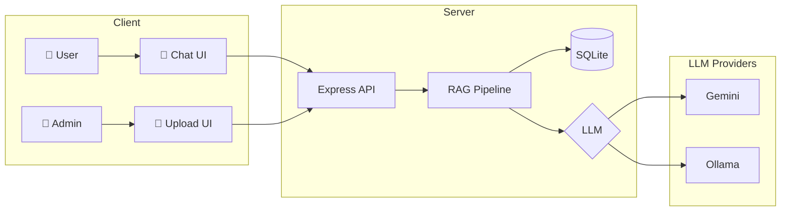

<div align="center">

# 🤖 Thai RAG Chatbot

### ระบบ Chatbot อัจฉริยะที่ตอบคำถามจากเอกสาร พร้อมรองรับภาษาไทย

[](https://nodejs.org/)
[](https://expressjs.com/)
[](https://sqlite.org/)
[](https://ai.google.dev/)
[](https://ollama.ai/)

[Features](#-features) •
[Installation](#-installation) •
[Usage](#-usage) •
[Configuration](#%EF%B8%8F-configuration) •
[API](#-api-endpoints)

</div>

---

## � Screenshots

<div align="center">
<table>
<tr>
<td align="center"><b>💬 Chat Interface</b></td>
<td align="center"><b>📁 Admin Panel</b></td>
</tr>
<tr>
<td>

```
┌─────────────────────────────┐
│  🤖 AI Assistant            │
├─────────────────────────────┤
│                             │
│  👤 มีเอกสารอะไรบ้าง?        │
│                             │
│  🤖 พบเอกสารที่เกี่ยวข้อง:    │
│     - ระเบียบการประชุม.pdf   │
│     - คู่มือพนักงาน.docx     │
│                             │
│  📎 แหล่งอ้างอิง [2 docs]    │
│                             │
├─────────────────────────────┤
│  พิมพ์ข้อความ...      [➤]   │
└─────────────────────────────┘
```

</td>
<td>

```
┌─────────────────────────────┐
│  🔐 Admin Panel             │
├─────────────────────────────┤
│                             │
│  ┌───────────────────────┐  │
│  │   � Drop files here  │  │
│  │   or click to upload  │  │
│  └───────────────────────┘  │
│                             │
│  📂 Documents (3)           │
│  ├─ 📕 report.pdf           │
│  ├─ 📘 manual.docx          │
│  └─ 📄 notes.txt            │
│                             │
└─────────────────────────────┘
```

</td>
</tr>
</table>
</div>

---

## ✨ Features

<table>
<tr>
<td>

### 🔍 RAG Pipeline
ค้นหาเอกสารที่เกี่ยวข้องก่อนตอบคำถาม เพื่อให้คำตอบตรงประเด็นและแม่นยำ

</td>
<td>

### 🇹🇭 Thai Optimized
ใช้ Google Gemini ที่เก่งภาษาไทยมาก (95/100 LannaAI Score)

</td>
</tr>
<tr>
<td>

### 🔄 Smart Fallback
```
Gemini → Ollama → Basic Response
```
ไม่พัง แม้ API quota หมด

</td>
<td>

### � Source Linking
ทุกคำตอบมีลิงก์ไปยังเอกสารต้นฉบับ พร้อม % ความเกี่ยวข้อง

</td>
</tr>
<tr>
<td>

### 📁 Multi-Format
รองรับ `PDF` `DOCX` `DOC` `TXT` `MD`

</td>
<td>

### 🎨 Modern UI
Dark theme + Glassmorphism + Animations

</td>
</tr>
</table>

---

## 🚀 Installation

### Prerequisites

- **Node.js** 18+
- **Gemini API Key** (ฟรี) - [Get it here](https://ai.google.dev/)
- **Ollama** (Optional) - [Download](https://ollama.ai/)

### Quick Start

```bash
# 1. Clone the repository
git clone https://github.com/taozeroxii/LLM-RAGOllama.git
cd LLM-RAGOllama

# 2. Install dependencies
npm install

# 3. Configure environment
cp .env.example .env
# Edit .env and add your GEMINI_API_KEY

# 4. Start the server
npm run dev
```

### 🎉 Open in browser

| Page | URL |
|------|-----|
| 💬 Chat | http://localhost:3000 |
| 📁 Admin | http://localhost:3000/admin |

---

## 📖 Usage

### Admin Panel

1. เปิด http://localhost:3000/admin
2. Login ด้วยรหัส `admin123`
3. **Drag & Drop** ไฟล์เอกสาร หรือ คลิกเพื่อเลือก
4. รอให้ระบบประมวลผล ✅

### Chat

1. เปิด http://localhost:3000
2. พิมพ์คำถามเกี่ยวกับเอกสาร
3. AI ตอบพร้อมแหล่งอ้างอิง
4. คลิกลิงก์เพื่อดูเอกสารต้นฉบับ

---

## ⚙️ Configuration

### Environment Variables

```env
# LLM Provider (gemini | ollama | auto)
LLM_PROVIDER=auto

# Google Gemini (Primary)
GEMINI_API_KEY=your_api_key_here

# Ollama (Fallback)
OLLAMA_BASE_URL=http://localhost:11434
OLLAMA_MODEL=llama3.2

# Security
ADMIN_PASSWORD=admin123

# Server
PORT=3000
```

### Setup Ollama (Recommended)

เมื่อ Gemini quota หมด จะ fallback ไป Ollama อัตโนมัติ:

```bash
# Install Ollama from https://ollama.ai

# Pull models
ollama pull llama3.2          # LLM
ollama pull nomic-embed-text  # Embeddings

# Verify
ollama list
```

---

## 🏗️ Architecture



---

## 📁 Project Structure

```
📦 LLM-RAGOllama
├── 📂 src/
│   ├── 📄 index.js              # Server entry
│   ├── 📄 database.js           # SQLite + Vector search
│   ├── 📂 routes/
│   │   ├── admin.js             # Upload & manage
│   │   ├── chat.js              # RAG Q&A
│   │   └── documents.js         # File serving
│   └── 📂 services/
│       ├── documentProcessor.js # Parse & chunk
│       ├── embeddingService.js  # Gemini/Ollama embeddings
│       └── ragService.js        # RAG with fallback
├── 📂 public/
│   ├── 📄 index.html            # Chat page
│   ├── 📄 style.css             # Chat styles
│   ├── 📄 app.js                # Chat logic
│   └── 📂 admin/                # Admin panel
├── 📂 uploads/                  # Documents
├── 📂 data/                     # SQLite DB
├── 📄 .env                      # Config
└── 📄 package.json
```

---

## � API Endpoints

### Authentication

```http
POST /api/admin/login
Content-Type: application/json

{ "password": "admin123" }
```

### Documents

```http
# Upload
POST /api/admin/upload
Authorization: Bearer {token}
Content-Type: multipart/form-data

# List
GET /api/admin/documents
Authorization: Bearer {token}

# Delete
DELETE /api/admin/documents/:id
Authorization: Bearer {token}

# Download
GET /api/documents/:id/download
```

### Chat

```http
POST /api/chat
Content-Type: application/json

{ "message": "มีระเบียบอะไรบ้าง?" }
```

**Response:**
```json
{
  "success": true,
  "answer": "จากเอกสารพบว่า...",
  "sources": [
    {
      "documentId": "abc-123",
      "documentName": "ระเบียบ.pdf",
      "relevance": 92
    }
  ]
}
```

---

## 🐛 Troubleshooting

| Problem | Solution |
|---------|----------|
| ชื่อไฟล์ไทยเพี้ยน | ระบบแก้ไขแล้ว (latin1 → UTF-8) |
| API quota หมด | ติดตั้ง Ollama เป็น fallback |
| Server start ไม่ได้ | ตรวจสอบ Node.js ≥18, npm install |
| ตอบคำถามไม่ได้ | อัพโหลดเอกสารก่อน |

---

## � License

MIT License © 2025

---

<div align="center">

### Made with ❤️ for Thai Language

**[⬆ Back to Top](#-thai-rag-chatbot)**

</div>