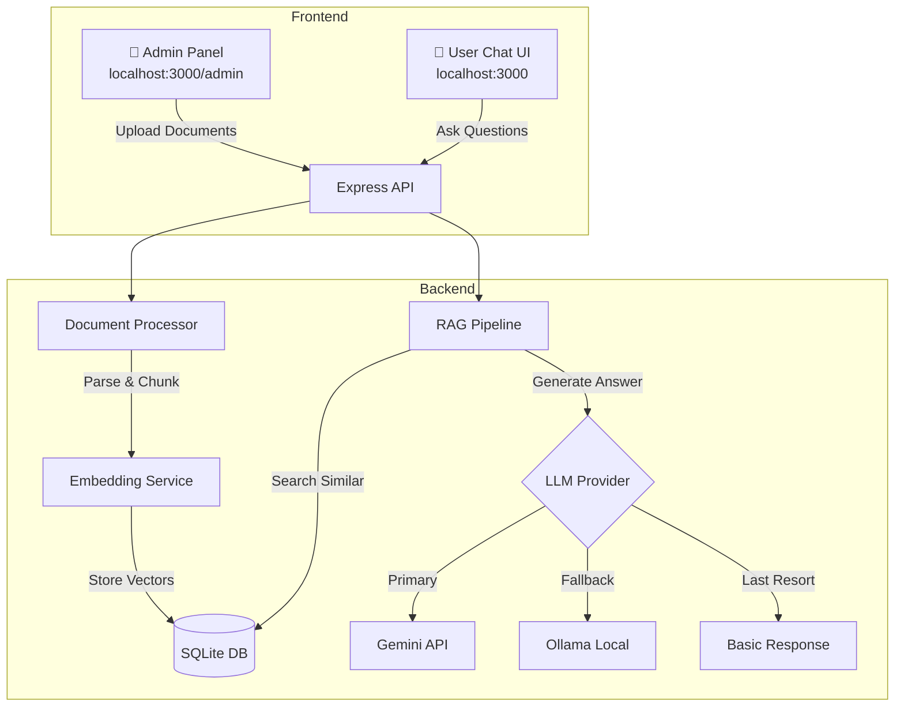

# Thai RAG Chatbot 🤖💬

ระบบ Chatbot อัจฉริยะที่ใช้ RAG (Retrieval-Augmented Generation) เพื่อตอบคำถามจากเอกสารที่อัพโหลด พร้อมรองรับภาษาไทยได้ดีเยี่ยม


---

## ✨ Features

| Feature | Description |
|---------|-------------|
| 📁 **Document Upload** | รองรับ PDF, DOCX, DOC, TXT, MD |
| 🔍 **RAG Pipeline** | ค้นหาเอกสารที่เกี่ยวข้องก่อนตอบคำถาม |
| 🇹🇭 **Thai Language** | Optimized สำหรับภาษาไทยด้วย Gemini |
| 🔄 **LLM Fallback** | Gemini → Ollama → Basic Response |
| 📎 **Source Links** | ลิงก์ไปยังเอกสารต้นฉบับในคำตอบ |
| 🎨 **Modern UI** | Dark theme พร้อม Glassmorphism effects |

---

## 🏗️ System Architecture



---

## 🚀 Quick Start

### 1. Clone และติดตั้ง Dependencies

```bash
cd node-Rag
npm install
```

### 2. ตั้งค่า Environment Variables

```bash
# แก้ไขไฟล์ .env
GEMINI_API_KEY=your_gemini_api_key_here
ADMIN_PASSWORD=admin123
PORT=3000
LLM_PROVIDER=auto
```

> 💡 ขอ Gemini API Key ฟรีได้ที่ https://ai.google.dev/

### 3. รัน Server

```bash
npm run dev
```

### 4. เปิดใช้งาน

- **Admin Panel**: http://localhost:3000/admin
- **Chat**: http://localhost:3000

---

## 📖 How to Use

### Admin Panel (จัดการเอกสาร)

1. เปิด http://localhost:3000/admin
2. Login ด้วยรหัส `admin123` (หรือตามที่ตั้งใน .env)
3. ลากไฟล์มาวางในพื้นที่ upload หรือคลิกเพื่อเลือกไฟล์
4. รอให้ระบบประมวลผลเอกสารเสร็จ

### Chat (ถามคำถาม)

1. เปิด http://localhost:3000
2. พิมพ์คำถามเกี่ยวกับเอกสารที่อัพโหลด
3. AI จะตอบพร้อมแสดงแหล่งอ้างอิง
4. คลิกที่ลิงก์เอกสารเพื่อดูต้นฉบับ

---

## ⚙️ Configuration

### Environment Variables (.env)

| Variable | Description | Default |
|----------|-------------|---------|
| `GEMINI_API_KEY` | Google Gemini API Key | - |
| `LLM_PROVIDER` | `gemini`, `ollama`, หรือ `auto` | `auto` |
| `OLLAMA_BASE_URL` | Ollama server URL | `http://localhost:11434` |
| `OLLAMA_MODEL` | Ollama model name | `llama3.2` |
| `ADMIN_PASSWORD` | รหัสผ่าน Admin | `admin123` |
| `PORT` | Port ของ server | `3000` |

### LLM Provider Modes

- **`gemini`**: ใช้ Gemini เท่านั้น
- **`ollama`**: ใช้ Ollama เท่านั้น
- **`auto`** (แนะนำ): ใช้ Gemini ก่อน ถ้าหมด quota จะ fallback ไป Ollama

---

## 🦙 Setup Ollama (Optional)

เมื่อ Gemini API quota หมด สามารถใช้ Ollama เป็น fallback ฟรี:

```bash
# 1. Download Ollama
# https://ollama.ai/download

# 2. Pull Thai-capable LLM model
ollama pull llama3.2

# 3. Pull embedding model
ollama pull nomic-embed-text

# 4. Verify installation
ollama list
```

---

## 📁 Project Structure

```
node-Rag/
├── src/
│   ├── index.js                    # Express server entry point
│   ├── database.js                 # SQLite + vector similarity search
│   ├── routes/
│   │   ├── admin.js                # Upload, auth, document management
│   │   ├── chat.js                 # RAG Q&A endpoint
│   │   └── documents.js            # Document serving
│   └── services/
│       ├── documentProcessor.js    # PDF/DOCX/TXT parsing & chunking
│       ├── embeddingService.js     # Gemini/Ollama embeddings
│       └── ragService.js           # RAG pipeline with fallback
├── public/
│   ├── index.html                  # Chat UI
│   ├── style.css                   # Chat styles (dark theme)
│   ├── app.js                      # Chat JavaScript
│   └── admin/
│       ├── index.html              # Admin UI
│       ├── style.css               # Admin styles
│       └── app.js                  # Admin JavaScript
├── uploads/                        # Uploaded document files
├── data/                           # SQLite database
│   └── rag.db
├── package.json
├── .env                            # Environment configuration
├── .env.example                    # Example configuration
└── README.md                       # This file
```

---

## 🔧 Technical Details

### RAG Pipeline Flow

1. **Document Upload** → Parse PDF/DOCX/TXT
2. **Text Chunking** → Split into 500-char overlapping chunks
3. **Embedding Generation** → Create vector embeddings (Gemini/Ollama)
4. **Vector Storage** → Store in SQLite with JSON embeddings
5. **Query** → Convert question to embedding
6. **Similarity Search** → Find top 5 similar chunks (cosine similarity)
7. **Context Building** → Combine relevant chunks
8. **LLM Generation** → Generate Thai response with sources

### Fallback Chain

```
┌─────────────┐     ┌─────────────┐     ┌─────────────────┐
│   Gemini    │ ──▶ │   Ollama    │ ──▶ │ Basic Response  │
│   (API)     │     │   (Local)   │     │ (Show excerpts) │
└─────────────┘     └─────────────┘     └─────────────────┘
      ↓ fail              ↓ fail              ↓ always works
```

### Supported File Types

| Type | Extension | Parser |
|------|-----------|--------|
| PDF | `.pdf` | pdf-parse |
| Word | `.docx`, `.doc` | mammoth |
| Text | `.txt`, `.md` | fs.readFile |

---

## 🐛 Troubleshooting

### ปัญหา: ชื่อไฟล์ภาษาไทยแสดงผิด

**สาเหตุ**: Multer อ่าน filename เป็น latin1
**แก้ไข**: ระบบแปลงเป็น UTF-8 อัตโนมัติแล้ว

### ปัญหา: AI ตอบไม่ได้ / API quota หมด

**แก้ไข**:
1. ติดตั้ง Ollama เป็น fallback (ดูวิธีด้านบน)
2. หรือรอ quota reset ที่ https://ai.google.dev/

### ปัญหา: Server start ไม่ได้

**ตรวจสอบ**:
1. Node.js version >= 18
2. `npm install` สำเร็จ
3. Port 3000 ว่างอยู่

---

## 📝 API Endpoints

### Admin Routes

| Method | Endpoint | Description |
|--------|----------|-------------|
| POST | `/api/admin/login` | Login with password |
| POST | `/api/admin/upload` | Upload document |
| GET | `/api/admin/documents` | List all documents |
| DELETE | `/api/admin/documents/:id` | Delete document |

### Chat Routes

| Method | Endpoint | Description |
|--------|----------|-------------|
| POST | `/api/chat` | Send message, get AI response |

### Document Routes

| Method | Endpoint | Description |
|--------|----------|-------------|
| GET | `/api/documents/:id` | Get document info |
| GET | `/api/documents/:id/download` | View/download document |

---

## 📜 License

MIT License

---

## 🙏 Credits

- [Google Gemini](https://ai.google.dev/) - LLM & Embeddings
- [Ollama](https://ollama.ai/) - Local LLM fallback
- [Express.js](https://expressjs.com/) - Web framework
- [better-sqlite3](https://github.com/WiseLibs/better-sqlite3) - Database
- [pdf-parse](https://www.npmjs.com/package/pdf-parse) - PDF parsing
- [mammoth](https://www.npmjs.com/package/mammoth) - DOCX parsing
# LLM-RAGOllama

